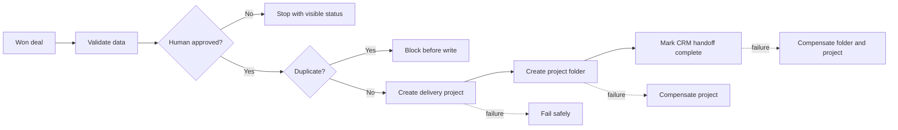

# CRM Deal-to-Delivery Handoff

An executable, controlled proof of a reliable handoff from a won CRM deal to
delivery operations.

This repository demonstrates the part that matters after two systems are
connected: validation, human approval, duplicate prevention, visible failure
states, compensating rollback logic and testable acceptance criteria.

> Proof boundary: this is a self-owned offline demonstration with fictional
> data. It makes zero external calls, contains no credentials, is not a client
> reference and is not presented as production-ready.

[Deutsche Erklärung](README.de.md)

## Business problem

A won deal often has to be copied from a CRM into project management, file
storage and delivery tracking. A simple connector can move fields, but it does
not automatically answer the operational questions:

- Are the required commercial and delivery fields complete?
- Has a person approved the handoff?
- Will a retry create the same project twice?
- What survives when the second or third system fails?
- Can another operator verify and maintain the result?

This proof turns those questions into explicit workflow rules and 20 executable
acceptance cases.

## What the workflow does



The demo models three system boundaries without connecting to any live
provider:

1. a CRM is the source of the won deal;
2. a project system receives the delivery project;
3. a file system receives the project folder.

Free-text notes are treated as untrusted data and never as workflow
instructions.

## Run the proof

Requirements:

- Python 3.10 or newer;
- Node.js 18 or newer;
- no accounts, API keys or network access.

From the repository root:

```bash
python3 tests/test_delivery_handoff_demo.py
```

Expected result:

```text
PASS: 20/20 fictional handoff cases, safety routes, and rollbacks verified
```

The workflow in `workflow/delivery-handoff-demo.json` can also be imported into
n8n for inspection. It is inactive, unavailable through MCP and contains only
manual and code nodes.

## Acceptance coverage

The test set includes:

- a successful approved handoff;
- missing and malformed required data;
- pending and rejected approvals;
- duplicate protection;
- safe failure before any resource is created;
- reverse-order compensation after partial failure;
- a retry after a safe failure;
- an untrusted-text case;
- field-count and currency boundaries;
- past-date review and Unicode handling.

See [the complete acceptance table](docs/acceptance-cases.md).

## Repository map

```text
workflow/  importable inactive n8n workflow
src/       reviewable fixture, business and QA logic
tests/     executable behavior and safety verification
docs/      acceptance cases and expected routes
```

## How this becomes a paid project

A real engagement starts only after the buyer defines the trigger, systems,
fields, test environment and acceptance owner. BETAN AI then returns a written
fixed scope, fixed price and delivery date. Provider credentials, real data and
production activation stay outside this proof and require a separate approved
delivery process.

BETAN AI · project-based CRM and API handoffs · info@betanaibrands.com

Copyright 2026 BETAN AI. All rights reserved.
